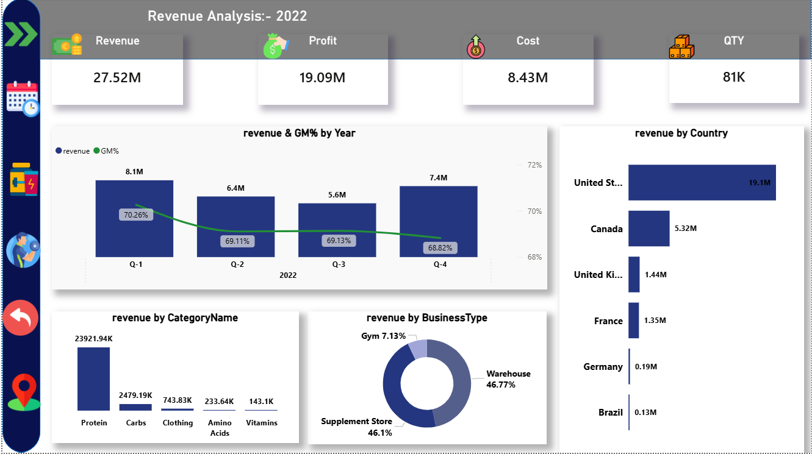
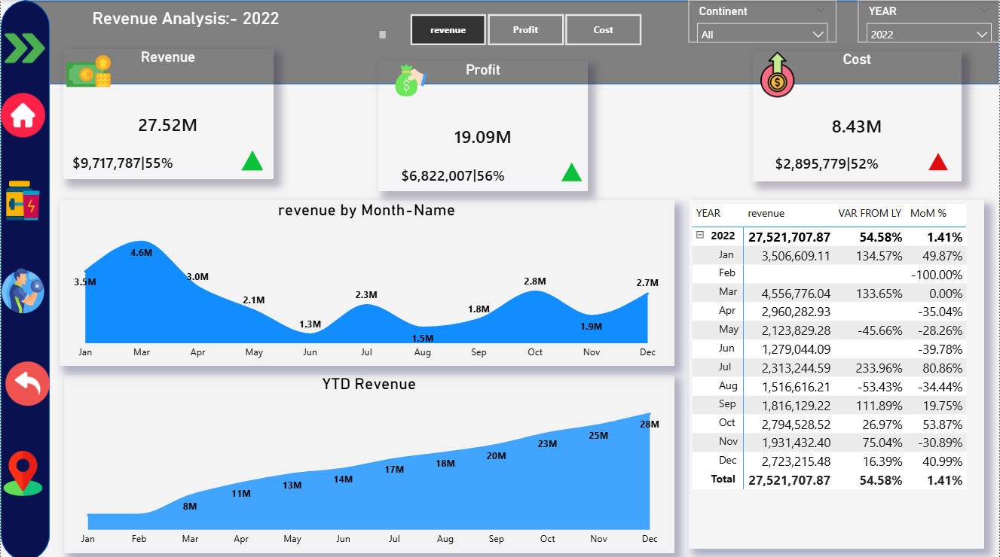
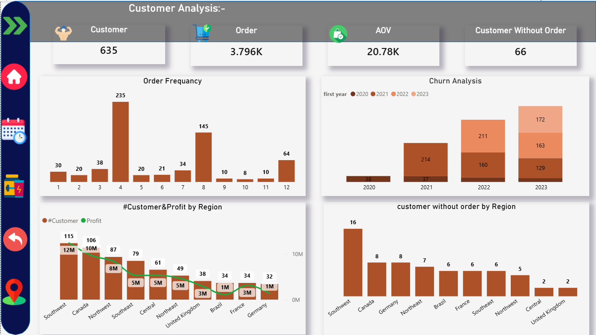
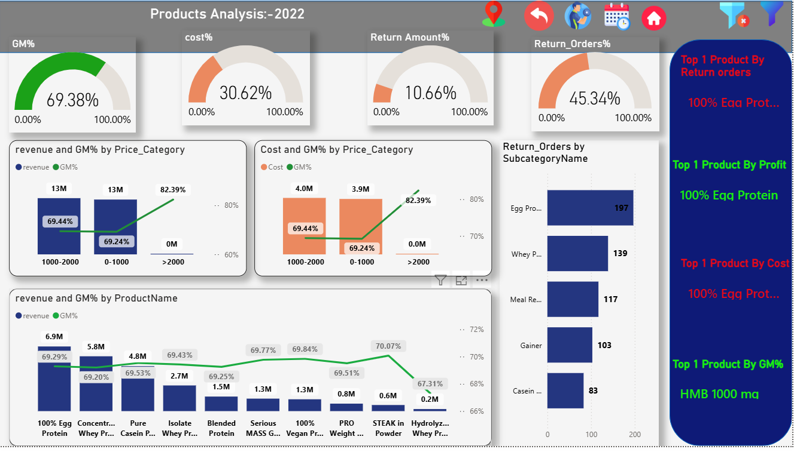
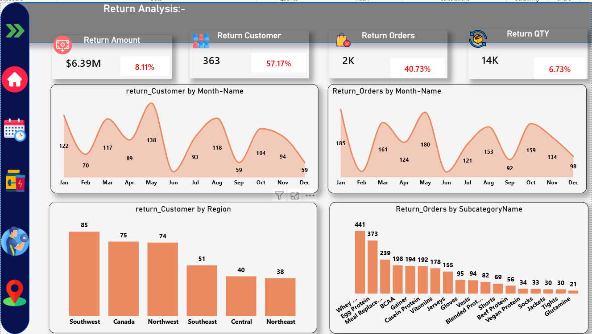
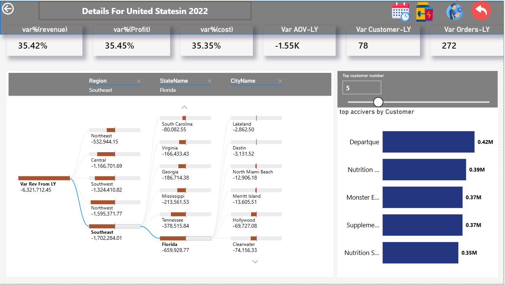

# 📊 Sports Nutrition Business Analysis  
## 🚀 Why Revenue Growth Isn’t Driving Profit

---

## 🧭 Executive Summary
Over a four-year period, the business generated **$78.87M in revenue**, yet **profit margins remained flat**.

Despite strong growth, the company is not creating additional value — revealing inefficiencies in pricing, returns, and customer retention.

💡 This analysis identifies **$7.76M in recoverable annual value** without requiring new customers or products.

---

## 🚨 Problem Statement
The business is experiencing **growth without profitability**.

📈 Revenue is increasing year-over-year  
💸 Costs are rising at the same rate  
📉 Profit margins remain unchanged  

➡️ Result: A **high-volume, low-efficiency model**

---

## 📊 Key Metrics

| 📌 Metric | 💰 Value |
|---------|--------|
| 💵 Total Revenue | $78.87M |
| 🎯 Recoverable Value | $7.76M / year |
| 🔁 Return Rate | 8.11% |
| 👥 Lost Customers | 66 |
| 🌍 Main Market | USA (66%) |

---

## 🔍 Key Insights

### 1️⃣ 📈 Growth Without Profit
- Revenue and costs both increased by **+22.84%**
- No margin expansion  

💡 Indicates weak pricing and cost control

---

### 2️⃣ 🔁 Returns = Hidden Profit Leak
- 8.11% revenue returned (~$6.39M)
- Peaks in **May & October**  
- No root-cause tracking  

💡 Operational blind spots are costing millions

---

### 3️⃣ 👥 Customer Churn Reduces Value
- 66 customers churned after first purchase  
- Major drop at **4th order (235 customers)**  

💡 No retention strategy = wasted acquisition cost

---

### 4️⃣ 🌍 Market Concentration Risk
- 66% of revenue from USA  

💡 High dependency = high risk

---

## 💡 Recommendations

### 🔴 Immediate (0–30 Days)
💰 Quick wins

- Increase prices by 2% → **+$1.58M**  
- Reduce returns → **+$800K**  
- Reactivate customers → **+$685K**

---

### 🟡 Short Term (30–60 Days)
⚙️ Stabilize operations

- Analyze return reasons  
- Track inactive customers  
- Start market diversification  

---

### 🟢 Mid Term (60–90 Days)
📈 Drive sustainable growth

- Loyalty program (4th & 8th orders)  
- Improve Customer Lifetime Value (CLV)  
- Strengthen retention strategy  

---

## 📈 Financial Impact

| 💼 Initiative | 💰 Value |
|-------------|--------|
| Pricing Optimization | $1.58M |
| Return Reduction | $0.80M |
| Customer Reactivation | $0.68M |
| **Total Opportunity** | **$7.76M / year** |

---

## 📊 Dashboard Preview

### 📌 Overview

### ⏳ Time Analysis

### 👥 Customer Analysis

### 📦 Product Analysis

### 🔁 Return Analysis

### 🌍 Location Analysis

---

## 🛠 Tools & Skills

- 📊 Power BI  
- 📑 Excel  
- 🧠 DAX  
- 📈 Business Analysis  

---

## 🧠 Analytical Techniques

- `SAMEPERIODLASTYEAR`  
- `CALCULATE`  
- `RANKX`  
- Cohort & retention analysis  

---

## 🚀 Key Takeaway
Profit growth doesn’t require more sales — it requires **better efficiency**.

🎯 Fix pricing, returns, and retention  
💰 Unlock **$7.76M annually**  
🚀 No new customers needed  

---

## 📬 Connect With Me

- 🔗 LinkedIn: https://www.linkedin.com/in/mostafagamalmostafa  
- 💻 GitHub: https://github.com/mostafa123gamal

---
